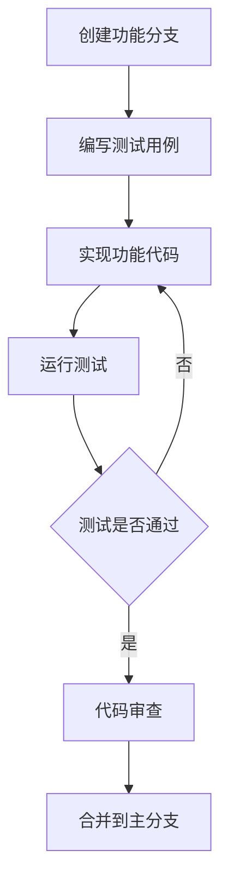

# Payment API 开发指南

## 📋 开发概述

本文档为Payment API项目的开发指南，涵盖开发环境搭建、代码结构、开发规范、测试策略和最佳实践。

## 🛠️ 开发环境搭建

### 1. 基础环境要求
- **Python**: 3.8+
- **MySQL**: 8.0+ (或SQLite用于快速开发)
- **Redis**: 6.x+
- **Git**: 版本控制
- **IDE**: PyCharm / VS Code (推荐)

### 2. 项目初始化
```bash
# 克隆项目
git clone <repository-url>
cd payment_api

# 创建虚拟环境
python -m venv venv

# 激活虚拟环境 (Linux/Mac)
source venv/bin/activate
# 或 Windows
venv\Scripts\activate

# 安装依赖
pip install -r requirements.txt

# 安装开发依赖
pip install pytest pytest-asyncio httpx black isort flake8
```

### 3. 本地配置
```bash
# 复制并编辑本地配置
cp src/web_config_local.py.example src/web_config_local.py

# 编辑配置文件
# 配置本地数据库和Redis连接信息
```

### 4. 数据库初始化
```bash
# 创建本地数据库（MySQL）
mysql -u root -p
CREATE DATABASE vegas CHARACTER SET utf8mb4 COLLATE utf8mb4_unicode_ci;

# 或使用SQLite（默认）
# 数据库文件会自动创建
```

### 5. 启动开发服务器
```bash
# 方式1: 使用项目脚本
python run.py

# 方式2: 直接使用uvicorn
uvicorn src.main:app --reload --host 0.0.0.0 --port 8000

# 访问API文档
# http://localhost:8000/docs
```

## 🏗️ 项目架构

### 分层架构
```
src/
├── routers/          # 路由层 - HTTP请求处理
├── service/          # 服务层 - 业务逻辑
├── schemas/          # 模式层 - 数据验证
├── models.py         # 模型层 - 数据库模型
├── main.py          # 应用入口
└── web_config.py    # 配置管理
```

### 核心组件

#### 1. 路由层 (Routers)
```python
# src/routers/payment_routes.py
from fastapi import APIRouter, Depends
from ..schemas.payment_schemas import PaymentRequest, PaymentResponse
from ..service.payment_service import process_payment

router = APIRouter(prefix="/api/v1")

@router.post("/payment", response_model=PaymentResponse)
async def create_payment(request: PaymentRequest):
    result = process_payment(request)
    return result
```

#### 2. 服务层 (Services)
```python
# src/service/payment_service.py
from typing import Dict, Any
from ..models import Payment, User
from .db_service import get_session

def process_payment(payment_data: Dict[str, Any]) -> Dict[str, Any]:
    """处理支付逻辑"""
    with get_session() as session:
        # 业务逻辑实现
        pass
```

#### 3. 模式层 (Schemas)
```python
# src/schemas/payment_schemas.py
from sqlmodel import SQLModel, Field
from typing import Optional

class PaymentRequest(SQLModel):
    order_id: str = Field(..., description="订单ID")
    amount: float = Field(..., description="支付金额")
    currency: str = Field(default="USD", description="货币类型")

class PaymentResponse(SQLModel):
    return_code: int = Field(..., description="返回码")
    msg: str = Field(..., description="返回消息")
```

#### 4. 模型层 (Models)
```python
# src/models.py
from sqlmodel import SQLModel, Field
from typing import Optional
from datetime import datetime

class Payment(SQLModel, table=True):
    __tablename__ = "payments"
    
    id: Optional[int] = Field(default=None, primary_key=True)
    order_id: str = Field(index=True)
    user_id: int = Field(foreign_key="users.id")
    amount: float
    currency: str = Field(default="USD")
    status: int = Field(default=0)
    created_at: datetime = Field(default_factory=datetime.utcnow)
```

## 📝 开发规范

### 1. 代码风格
```python
# 使用Black格式化代码
black src/

# 使用isort排序导入
isort src/

# 使用flake8检查代码质量
flake8 src/
```

### 2. 命名规范
- **文件名**: 使用下划线命名法 `payment_service.py`
- **类名**: 使用Pascal命名法 `PaymentService`
- **函数名**: 使用下划线命名法 `process_payment`
- **变量名**: 使用下划线命名法 `user_id`
- **常量名**: 使用大写字母 `MAX_RETRY_COUNT`

### 3. 注释规范
```python
def process_payment(payment_data: Dict[str, Any]) -> Dict[str, Any]:
    """
    处理支付业务逻辑
    
    Args:
        payment_data: 支付数据字典，包含订单ID、金额等信息
        
    Returns:
        Dict[str, Any]: 处理结果，包含成功状态和相关信息
        
    Raises:
        ValueError: 当支付数据无效时抛出
        DatabaseError: 当数据库操作失败时抛出
    """
    pass
```

### 4. 错误处理
```python
from fastapi import HTTPException
import logging

logger = logging.getLogger(__name__)

async def payment_endpoint(request: PaymentRequest):
    try:
        result = process_payment(request.dict())
        return result
    except ValueError as e:
        logger.error(f"Invalid payment data: {str(e)}")
        raise HTTPException(status_code=400, detail=str(e))
    except DatabaseError as e:
        logger.error(f"Database error: {str(e)}")
        raise HTTPException(status_code=500, detail="Internal server error")
```

## 🔧 开发工具配置

### 1. VS Code配置
```json
// .vscode/settings.json
{
    "python.defaultInterpreterPath": "./venv/bin/python",
    "python.linting.enabled": true,
    "python.linting.flake8Enabled": true,
    "python.formatting.provider": "black",
    "python.sortImports.enabled": true,
    "editor.formatOnSave": true,
    "editor.codeActionsOnSave": {
        "source.organizeImports": true
    }
}
```

### 2. PyCharm配置
- 配置Python解释器为项目虚拟环境
- 启用Code Style -> Python -> Black formatter
- 配置Run/Debug Configuration为uvicorn启动

### 3. Git钩子配置
```bash
# .git/hooks/pre-commit
#!/bin/bash
echo "Running pre-commit checks..."

# 代码格式化
black src/
isort src/

# 代码检查
flake8 src/
if [ $? -ne 0 ]; then
    echo "flake8 检查失败，请修复代码问题"
    exit 1
fi

# 运行测试
pytest tests/
if [ $? -ne 0 ]; then
    echo "测试失败，请检查测试用例"
    exit 1
fi

echo "所有检查通过"
```

## 🧪 测试策略

### 1. 测试结构
```
tests/
├── unit/              # 单元测试
│   ├── test_services.py
│   ├── test_models.py
│   └── test_utils.py
├── integration/       # 集成测试
│   ├── test_api.py
│   └── test_database.py
├── e2e/              # 端到端测试
│   └── test_payment_flow.py
└── conftest.py       # 测试配置
```

### 2. 单元测试示例
```python
# tests/unit/test_payment_service.py
import pytest
from unittest.mock import Mock, patch
from src.service.payment_service import process_payment

class TestPaymentService:
    def test_process_payment_success(self):
        """测试支付处理成功场景"""
        payment_data = {
            "order_id": "test_order_001",
            "uid": "test_user",
            "item_id": 1,
            "price": 19.99,
            "currency": "USD"
        }
        
        result = process_payment(payment_data)
        
        assert result["success"] is True
        assert "tokens_granted" in result
        
    def test_process_payment_invalid_data(self):
        """测试无效数据处理"""
        invalid_data = {"invalid": "data"}
        
        with pytest.raises(ValueError):
            process_payment(invalid_data)
```

### 3. 集成测试示例
```python
# tests/integration/test_api.py
import pytest
from fastapi.testclient import TestClient
from src.main import app

client = TestClient(app)

class TestPaymentAPI:
    def test_payment_success_endpoint(self):
        """测试支付成功接口"""
        # 首先获取Token
        token_response = client.post("/api/v1/token", json={
            "appId": "com.funtriolimited.slots.casino.free"
        })
        token = token_response.json()["token"]
        
        # 测试支付成功
        payment_data = {
            "order_id": "test_order_001",
            "uid": "test_user",
            "item_id": 1,
            "price": 19.99,
            "currency": "USD",
            "payment_channel": "appcharge",
            "payment_method": "credit_card",
            "email": "test@example.com"
        }
        
        response = client.post(
            "/api/v1/payment/success",
            json=payment_data,
            headers={"Authorization": f"Bearer {token}"}
        )
        
        assert response.status_code == 200
        data = response.json()
        assert data["return_code"] == 1
```

### 4. 测试配置
```python
# conftest.py
import pytest
from sqlmodel import create_engine, SQLModel
from src.database import get_session
from src.models import *

@pytest.fixture
def test_db():
    """测试数据库配置"""
    engine = create_engine("sqlite:///:memory:")
    SQLModel.metadata.create_all(engine)
    return engine

@pytest.fixture
def test_session(test_db):
    """测试数据库会话"""
    with Session(test_db) as session:
        yield session
```

### 5. 运行测试
```bash
# 运行所有测试
pytest

# 运行特定测试
pytest tests/unit/test_payment_service.py

# 运行测试并生成覆盖率报告
pytest --cov=src tests/

# 运行测试并生成HTML覆盖率报告
pytest --cov=src --cov-report=html tests/
```

## 🔄 开发流程

### 1. 功能开发流程


### 2. Git工作流
```bash
# 1. 创建功能分支
git checkout -b feature/payment-refund

# 2. 开发功能
# 编写代码...

# 3. 提交代码
git add .
git commit -m "feat: 添加支付退款功能"

# 4. 推送分支
git push origin feature/payment-refund

# 5. 创建Pull Request
# 在GitHub/GitLab上创建PR

# 6. 代码审查通过后合并
git checkout main
git pull origin main
git branch -d feature/payment-refund
```

### 3. 提交消息规范
```bash
# 类型(范围): 简短描述

feat(payment): 添加支付退款功能
fix(login): 修复Facebook登录问题
docs(api): 更新API文档
style(format): 代码格式化
refactor(service): 重构支付服务
test(unit): 添加单元测试
chore(deps): 更新依赖包
```

## 🐛 调试技巧

### 1. 日志调试
```python
import logging

# 配置日志
logging.basicConfig(
    level=logging.DEBUG,
    format='%(asctime)s - %(name)s - %(levelname)s - %(message)s'
)

logger = logging.getLogger(__name__)

def process_payment(payment_data):
    logger.debug(f"Processing payment: {payment_data}")
    
    try:
        # 处理逻辑
        result = do_payment_processing(payment_data)
        logger.info(f"Payment processed successfully: {result}")
        return result
    except Exception as e:
        logger.error(f"Payment processing failed: {str(e)}", exc_info=True)
        raise
```

### 2. 断点调试
```python
# 使用pdb进行断点调试
import pdb

def process_payment(payment_data):
    pdb.set_trace()  # 设置断点
    # 调试代码...
```

### 3. 性能分析
```python
import time
import functools

def timing_decorator(func):
    @functools.wraps(func)
    def wrapper(*args, **kwargs):
        start_time = time.time()
        result = func(*args, **kwargs)
        end_time = time.time()
        print(f"{func.__name__} 执行时间: {end_time - start_time:.4f}秒")
        return result
    return wrapper

@timing_decorator
def process_payment(payment_data):
    # 支付处理逻辑
    pass
```

## 📊 性能优化

### 1. 数据库优化
```python
# 使用批量操作
from sqlmodel import select

def get_user_payments_batch(user_ids: List[int]):
    """批量获取用户支付记录"""
    with get_session() as session:
        statement = select(Payment).where(Payment.user_id.in_(user_ids))
        payments = session.exec(statement).all()
        return payments

# 使用索引优化查询
class Payment(SQLModel, table=True):
    user_id: int = Field(index=True)  # 添加索引
    created_at: datetime = Field(index=True)  # 添加索引
```

### 2. 缓存优化
```python
from functools import lru_cache
import redis

# 内存缓存
@lru_cache(maxsize=1000)
def get_item_config(item_id: int):
    """获取商品配置（带缓存）"""
    return load_item_config_from_db(item_id)

# Redis缓存
class CacheService:
    def __init__(self):
        self.redis_client = redis.Redis(host='localhost', port=6379, db=0)
    
    def get_cached_result(self, key: str, fetch_func, expire_time: int = 3600):
        """通用缓存获取方法"""
        cached_data = self.redis_client.get(key)
        if cached_data:
            return json.loads(cached_data)
        
        data = fetch_func()
        self.redis_client.setex(key, expire_time, json.dumps(data))
        return data
```

### 3. 异步优化
```python
import asyncio
from sqlmodel.ext.asyncio.session import AsyncSession

async def process_payment_async(payment_data: Dict[str, Any]):
    """异步处理支付"""
    async with get_async_session() as session:
        # 异步数据库操作
        result = await session.exec(statement)
        return result

# 并发处理
async def process_multiple_payments(payment_list: List[Dict]):
    """并发处理多个支付"""
    tasks = [process_payment_async(payment) for payment in payment_list]
    results = await asyncio.gather(*tasks, return_exceptions=True)
    return results
```

## 🔧 常用开发工具

### 1. API测试工具
```python
# 使用httpx进行API测试
import httpx

async def test_api():
    async with httpx.AsyncClient() as client:
        response = await client.post(
            "http://localhost:8000/api/v1/payment/success",
            json=payment_data,
            headers={"Authorization": f"Bearer {token}"}
        )
        print(response.json())
```

### 2. 数据库迁移
```python
# 使用alembic进行数据库迁移
# alembic init alembic
# alembic revision --autogenerate -m "Add payment table"
# alembic upgrade head
```

### 3. 环境管理
```python
# 使用python-dotenv管理环境变量
from dotenv import load_dotenv
import os

load_dotenv()

DATABASE_URL = os.getenv("DATABASE_URL", "sqlite:///./payment_api.db")
REDIS_URL = os.getenv("REDIS_URL", "redis://localhost:6379")
```

## 📚 学习资源

### 官方文档
- [FastAPI文档](https://fastapi.tiangolo.com/)
- [SQLModel文档](https://sqlmodel.tiangolo.com/)
- [Pydantic文档](https://pydantic-docs.helpmanual.io/)

### 最佳实践
- [FastAPI最佳实践](https://github.com/zhanymkanov/fastapi-best-practices)
- [Python异步编程](https://docs.python.org/3/library/asyncio.html)
- [API设计指南](https://restfulapi.net/)

### 工具推荐
- **代码格式化**: Black, isort
- **代码检查**: flake8, pylint
- **类型检查**: mypy
- **测试工具**: pytest, httpx
- **API文档**: FastAPI自动生成
- **性能分析**: py-spy, line_profiler

## 🤝 贡献指南

### 1. 代码贡献流程
1. Fork项目仓库
2. 创建功能分支
3. 编写代码和测试
4. 提交Pull Request
5. 代码审查
6. 合并到主分支

### 2. 问题报告
- 使用GitHub Issues报告bug
- 提供详细的复现步骤
- 包含错误日志和环境信息

### 3. 功能建议
- 在Issues中提出功能需求
- 描述使用场景和预期效果
- 讨论实现方案

---

> 📝 **注意**: 
> - 遵循项目的编码规范和最佳实践
> - 编写充分的测试用例
> - 保持代码简洁和可读性
> - 及时更新文档
> 
> 🔗 **相关文档**:
> - 参考 `docs/API_TESTING.md` 了解API测试
> - 查看 `docs/DEPLOYMENT_GUIDE.md` 了解部署流程